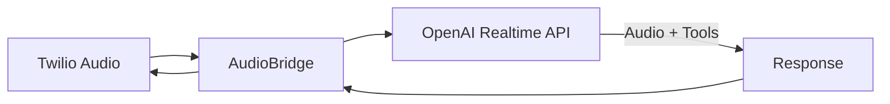
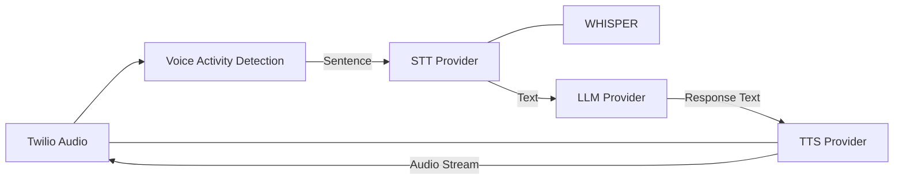
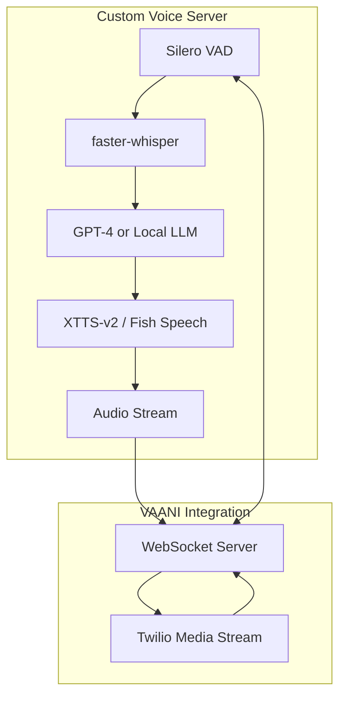

# Voice Provider Migration Roadmap

> **Goal**: Replace OpenAI Realtime API with alternative STT + LLM + TTS pipeline

---

## Why Migrate?

| OpenAI Realtime API | Alternative Pipeline |
|---------------------|----------------------|
| ❌ Fixed voices (alloy, shimmer, etc.) | ✅ 1000+ voices, custom cloning |
| ❌ Robotic, "flat" intonation | ✅ Natural, emotional speech |
| ❌ English-centric accents | ✅ Hindi, Indian English accents |
| ❌ No voice customization | ✅ Full control over style, emotion |
| ✅ Single WebSocket connection | ❌ Multiple API calls (more latency) |
| ✅ End-to-end latency ~400ms | ⚠️ Latency ~800-1200ms |

---

## Architecture Comparison

### Current: OpenAI Realtime (Single Connection)



### New: STT + LLM + TTS (Pipeline)



---

## Migration Options Overview

### Option 1: Whisper Only — Is It Enough?

**❌ NO** — Whisper is **ONLY** a Speech-to-Text (STT) model.

| Whisper Provides | Whisper Does NOT Provide |
|------------------|--------------------------|
| ✅ Audio → Text transcription | ❌ Text → Audio (TTS) |
| ✅ 99 language support | ❌ Voice synthesis |
| ✅ High accuracy (94-96%) | ❌ Real-time streaming |

**You would still need**: TTS provider + LLM + VAD

---

### Option 2: ElevenLabs Only — Is It Enough?

**❌ NO** — ElevenLabs is **ONLY** a Text-to-Speech (TTS) model.

| ElevenLabs Provides | ElevenLabs Does NOT Provide |
|---------------------|------------------------------|
| ✅ Text → Natural voice audio | ❌ Audio → Text (STT) |
| ✅ Voice cloning | ❌ Transcription |
| ✅ 1000+ voices, Indian accents | ❌ Conversation logic |

**You would still need**: STT provider + LLM

---

## All Available Providers

### STT (Speech-to-Text) Options

| Provider | Latency | Accuracy | Hindi/Indian | Self-Host | Cost (per hour) |
|----------|---------|----------|--------------|-----------|-----------------|
| **Deepgram** (Nova-3) | ~100-300ms ⚡ | 95%+ | ✅ Yes | ✅ Optional | ~$0.36 |
| **AssemblyAI** | ~500ms | 96-98% | ⚠️ Limited | ❌ No | ~$0.37 |
| **Whisper** (OpenAI API) | ~1-2s | 94-96% | ✅ Yes (99 langs) | ✅ Yes (free) | ~$0.36 |
| **Google Cloud STT** | ~200ms | 93%+ | ✅ Yes | ❌ No | ~$0.36-0.48 |
| **Azure Speech** | ~200ms | 93%+ | ✅ Yes | ❌ No | ~$1.00 |
| **Gladia** | ~200ms | 95%+ | ✅ Yes (100+ langs) | ❌ No | ~$0.30 |

> [!TIP]
> **Recommended for VAANI**: **Deepgram** — fastest real-time streaming, good Hindi support.

---

### TTS (Text-to-Speech) Options

| Provider | Voice Quality | Indian Voices | Voice Cloning | Latency | Cost (per 1M chars) |
|----------|---------------|---------------|---------------|---------|---------------------|
| **ElevenLabs** | ⭐⭐⭐⭐⭐ Best | ✅ Yes | ✅ Yes | ~200ms | ~$300 |
| **Cartesia** | ⭐⭐⭐⭐⭐ Excellent | ✅ Yes | ✅ Yes | ~100ms ⚡ | ~$100 |
| **Amazon Polly** | ⭐⭐⭐ Good | ✅ Hindi voices | ❌ No | ~100ms | ~$4 |
| **Google Cloud TTS** | ⭐⭐⭐⭐ Very Good | ✅ Yes | ❌ No | ~150ms | ~$16 |
| **Azure TTS** | ⭐⭐⭐⭐ Very Good | ✅ Yes | ✅ Custom Voice | ~150ms | ~$16 |
| **Play.ht** | ⭐⭐⭐⭐ Very Good | ✅ Yes | ✅ Yes | ~300ms | ~$200 |
| **LMNT** | ⭐⭐⭐⭐ Very Good | ⚠️ Limited | ✅ Yes | ~80ms ⚡ | ~$150 |

> [!TIP]
> **Recommended for VAANI**: **Cartesia** — ElevenLabs quality at lower cost, faster latency.

---

### Full Pipeline Frameworks

| Solution | Description | Pros | Cons |
|----------|-------------|------|------|
| **Pipecat** (open-source) | Real-time voice AI framework | Full control, free | Need to integrate providers |
| **LiveKit Agents** | Open-source WebRTC + Voice AI | Low latency, real-time | Requires setup |
| **Hume AI** | Emotion-aware voice AI | Emotional understanding | Less flexibility |
| **Retell AI** | Voice AI platform | Easy to use | Black-box, less control |

---

## Option 3: Open-Source Voice Cloning (Build Your Own)

### Available Models

| Model | Training Data | Languages | License | Quality |
|-------|---------------|-----------|---------|---------|
| **XTTS-v2** (Coqui) | 6-30 seconds | 17 languages | CPAL | ⭐⭐⭐⭐⭐ |
| **OpenVoice V2** | 10-60 seconds | 6 languages | MIT ✅ | ⭐⭐⭐⭐ |
| **Chatterbox** (Resemble) | 10+ seconds | English | MIT ✅ | ⭐⭐⭐⭐ |
| **Fish Speech V1.5** | ~10 seconds | 8 languages | Apache 2.0 ✅ | ⭐⭐⭐⭐⭐ |
| **RVC** | 10-30 min audio | Any | MIT ✅ | ⭐⭐⭐⭐ |
| **Parler-TTS** | Custom dataset | English | Apache 2.0 ✅ | ⭐⭐⭐⭐ |

> [!IMPORTANT]
> **Recommended**: **XTTS-v2** or **Fish Speech V1.5** — Best quality, minimal training data, good multi-language support.

---

### Self-Hosted Architecture



### Implementation Phases

| Phase | Task | Effort | Tools |
|-------|------|--------|-------|
| **1** | Set up inference server | 1 week | FastAPI + PyTorch |
| **2** | Deploy Whisper (STT) | 2-3 days | `faster-whisper` (GPU optimized) |
| **3** | Deploy TTS model | 3-4 days | XTTS-v2 / Fish Audio |
| **4** | Train on custom voice | 1-2 days | 30+ min voice recordings |
| **5** | Build WebSocket bridge | 4-5 days | FastAPI + asyncio |
| **6** | VAD + Audio buffering | 2-3 days | Silero VAD |
| **7** | Integrate with VAANI | 3-4 days | Replace `openai_realtime.py` |

**Total: ~4-6 weeks**

### Hardware Requirements

| Model | VRAM Required | Example GPU |
|-------|---------------|-------------|
| faster-whisper (large-v3) | 10 GB | RTX 3080 / A10 |
| XTTS-v2 | 4-6 GB | RTX 3070 |
| Fish Speech | 4-8 GB | RTX 3080 |
| **Combined** | **16+ GB** | RTX 4090 / A100 |

> [!NOTE]
> Cloud GPU options: RunPod, Lambda Labs, Vast.ai (~$0.50-1.00/hour)

---

## Files to Modify

| File | Change |
|------|--------|
| [openai_realtime.py](file:///Users/mdkashifakram/Desktop/PROJECTS/AI/VAANI/v2/backend/app/core/openai_realtime.py) | **REPLACE** with new `voice_pipeline.py` |
| [voice.py](file:///Users/mdkashifakram/Desktop/PROJECTS/AI/VAANI/v2/backend/app/api/routes/voice.py) | Modify to use new pipeline client |
| [audio_bridge.py](file:///Users/mdkashifakram/Desktop/PROJECTS/AI/VAANI/v2/backend/app/core/audio_bridge.py) | Add VAD + buffering logic |
| [config.py](file:///Users/mdkashifakram/Desktop/PROJECTS/AI/VAANI/v2/backend/app/config.py) | Add new API keys + voice settings |
| `.env` | Add provider API keys + voice IDs |

### New Files to Create

| File | Purpose |
|------|---------| 
| `stt_client.py` | STT wrapper (Deepgram/Whisper/etc.) |
| `tts_client.py` | TTS wrapper (Cartesia/ElevenLabs/etc.) |
| `voice_pipeline.py` | Orchestrator replacing OpenAI Realtime |
| `vad.py` | Voice Activity Detection for sentence boundaries |

---

## Recommended Migration Paths

### Path A: Fastest (Managed APIs)

| Component | Provider | Why |
|-----------|----------|-----|
| STT | **Deepgram** | Fastest real-time, good Hindi |
| LLM | **GPT-4 Turbo** | Same as current |
| TTS | **Cartesia** | ElevenLabs quality, lower cost |

- **Timeline**: 2-3 weeks
- **Extra Cost**: ~$100-150/month

---

### Path B: Cost-Optimized (Hybrid)

| Component | Provider | Why |
|-----------|----------|-----|
| STT | **Whisper** (self-hosted) | Free after GPU costs |
| LLM | **GPT-4 Turbo** | Same as current |
| TTS | **Amazon Polly** | Cheapest |

- **Timeline**: 3-4 weeks
- **Extra Cost**: ~$10-20/month + GPU costs

---

### Path C: Full Custom (Your Own Voice)

| Component | Provider | Why |
|-----------|----------|-----|
| STT | **faster-whisper** (local) | Free, fast |
| LLM | **GPT-4** or local LLM | Flexible |
| TTS | **XTTS-v2** / **Fish Speech** | Full control, trained on your voice |

- **Timeline**: 4-6 weeks
- **Extra Cost**: GPU hosting ~$50-200/month

---

## Latency Comparison

| Step | OpenAI Realtime | Path A (APIs) | Path C (Self-Host) |
|------|-----------------|---------------|---------------------|
| STT | ~100ms (internal) | ~200ms (Deepgram) | ~300ms (Whisper) |
| LLM | ~100-200ms | ~200-400ms | ~200-400ms |
| TTS | ~100-200ms (internal) | ~100ms (Cartesia) | ~300ms (XTTS) |
| **Total** | **~400ms** | **~600-800ms** | **~800-1200ms** |

> [!WARNING]
> Expect latency increase. Optimize using streaming everywhere.

---

## Cost Comparison (Monthly, 1000 calls @ 2 min avg)

| Service | OpenAI Realtime | Path A | Path B | Path C |
|---------|-----------------|--------|--------|--------|
| STT | Included | ~$30 | ~$0 | ~$0 |
| LLM | ~$60 | ~$40 | ~$40 | ~$40 |
| TTS | Included | ~$50 | ~$5 | ~$0 |
| GPU | N/A | N/A | ~$50 | ~$100 |
| **Total** | **~$60** | **~$120** | **~$95** | **~$140** |

---

## Migration Strategy

### Option A: Hard Cutover
- Replace OpenAI Realtime completely
- Lower risk of maintaining two systems
- Requires thorough testing

### Option B: Feature Flag (Recommended)

```python
# voice.py
if settings.use_openai_realtime:
    client = OpenAIRealtimeClient(...)
else:
    client = VoicePipeline(...)
```

- Keep both systems
- Switch via `USE_OPENAI_REALTIME=false` env var
- Easier rollback if issues

---

## Configuration Changes

```python
# config.py additions
class Settings(BaseSettings):
    # Voice Pipeline Provider Selection
    use_openai_realtime: bool = True  # Feature flag
    stt_provider: str = "deepgram"    # deepgram | whisper | assemblyai
    tts_provider: str = "cartesia"    # cartesia | elevenlabs | polly
    
    # Deepgram
    deepgram_api_key: str = ""
    
    # Cartesia
    cartesia_api_key: str = ""
    cartesia_voice_id: str = ""
    
    # ElevenLabs (alternative)
    elevenlabs_api_key: str = ""
    elevenlabs_voice_id: str = "21m00Tcm4TlvDq8ikWAM"  # Rachel default
    elevenlabs_model: str = "eleven_turbo_v2"
    
    # VAD Settings
    vad_silence_threshold_ms: int = 500
```

---

## Implementation Timeline

| Week | Tasks |
|------|-------|
| **Week 1** | STT client + TTS client + basic integration tests |
| **Week 2** | VAD implementation + audio buffering |
| **Week 3** | Full pipeline integration + feature flag |
| **Week 4** | Testing, latency optimization, production deploy |

---

## Summary

| Aspect | Recommendation |
|--------|----------------|
| **STT Provider** | Deepgram (real-time) or Whisper (self-host) |
| **TTS Provider** | Cartesia (best balance) or ElevenLabs (best quality) |
| **LLM** | GPT-4 Turbo (same as current) |
| **VAD** | Silero VAD (best accuracy) |
| **Migration** | Feature flag approach |
| **Timeline** | 2-6 weeks depending on path |
| **Self-Host** | Doable with XTTS-v2 or Fish Speech |
