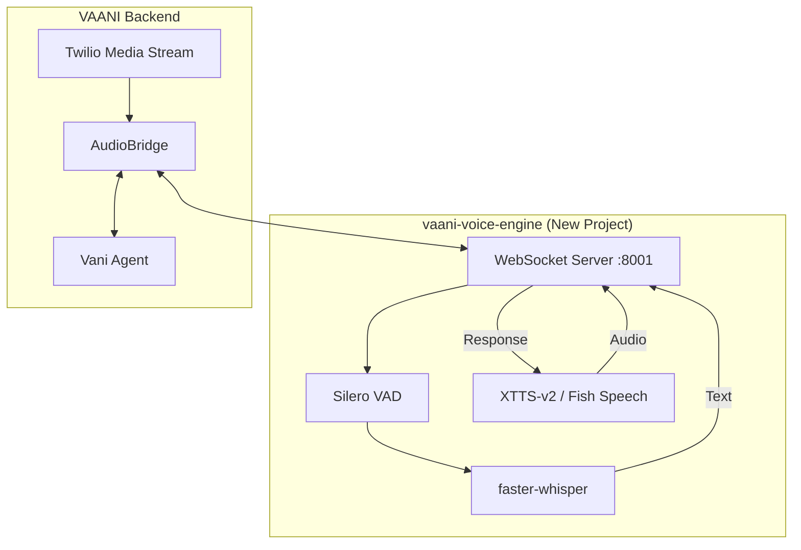

# Custom Voice Pipeline Project Guide

> **Goal**: Build a custom STT ↔ TTS voice engine as a separate project, train on custom voice, integrate with VAANI

---

## Overview

A standalone voice processing server (`vaani-voice-engine`) that handles:
- **STT**: Audio → Text (faster-whisper)
- **TTS**: Text → Audio (XTTS-v2 or Fish Speech)
- **WebSocket**: Real-time bi-directional audio streaming
- **Voice Training**: Custom voice model trained on your voice

---

## Architecture



---

## Project Structure

```
vaani-voice-engine/
├── app/
│   ├── main.py              # FastAPI + WebSocket server
│   ├── config.py
│   ├── stt/
│   │   ├── whisper_client.py
│   │   └── vad.py
│   ├── tts/
│   │   ├── xtts_client.py
│   │   └── fish_client.py
│   ├── pipeline/
│   │   └── voice_pipeline.py
│   └── audio/
│       └── converter.py     # μ-law ↔ PCM
├── models/
├── training/
│   ├── voice_samples/
│   └── train_xtts.ipynb
├── requirements.txt
└── Dockerfile
```

---

## Technology Stack

| Component | Technology | Hardware |
|-----------|------------|----------|
| **STT** | faster-whisper (large-v3) | Mac M4 (MPS) / GPU |
| **VAD** | Silero VAD | CPU |
| **TTS** | XTTS-v2 or Fish Speech | Mac M4 / Colab GPU |
| **Server** | FastAPI + WebSocket | localhost:8001 |

---

## Dependencies

```txt
# Core
fastapi>=0.115.0
uvicorn[standard]>=0.30.0
websockets>=12.0

# STT
faster-whisper>=1.0.0
silero-vad>=1.0.0

# TTS
TTS>=0.22.0  # XTTS-v2

# Audio
numpy>=1.24.0
scipy>=1.11.0
soundfile>=0.12.0
torch>=2.1.0
torchaudio>=2.1.0

# Utils
python-dotenv>=1.0.0
pydantic-settings>=2.0.0
```

---

## Implementation Phases

### Phase 1: Project Setup
- Create project structure
- Set up Python environment with PyTorch + MPS

### Phase 2: STT Component
- Implement faster-whisper wrapper
- Add Silero VAD for speech boundary detection
- Create audio buffering logic

### Phase 3: TTS Component
- Set up XTTS-v2 or Fish Speech
- Implement streaming audio output

### Phase 4: Voice Training (Google Colab)
- Record 10-30 min of voice samples
- Train on Colab T4 GPU (free tier)
- Export trained model

### Phase 5: WebSocket Server
- Build unified WebSocket (STT ↔ TTS)
- Add μ-law ↔ PCM conversion

### Phase 6: VAANI Integration
- Connect AudioBridge to voice engine
- Add feature flag for engine selection

---

## Voice Training Requirements

| Requirement | Details |
|-------------|---------|
| **Duration** | 10-30 minutes |
| **Format** | WAV, 22050 Hz, mono |
| **Content** | Diverse Hindi/English text |
| **Quality** | Clear audio, minimal noise |

---

## VAANI Integration

### Config Changes

```python
# backend/app/config.py
class Settings(BaseSettings):
    voice_engine: str = "openai"  # "openai" | "custom"
    custom_voice_engine_url: str = "ws://localhost:8001"
```

### Feature Flag Usage

```python
# Select engine based on audience
if caller_region == "IN":
    engine = CustomVoicePipeline()  # Indian accent
else:
    engine = OpenAIRealtimeClient()  # US/UK
```

---

## Timeline

| Week | Tasks |
|------|-------|
| **1** | Project setup, faster-whisper + VAD |
| **2** | XTTS-v2 setup, WebSocket server |
| **3** | Voice training on Colab |
| **4** | VAANI integration |
| **5** | Optimization, latency tuning |
| **6** | Production deployment |

---

## Related Docs

- [Voice Migration Roadmap](voice_migration_roadmap.md) — All migration options
- [Startup Guide](startup_guide.md) — Running VAANI
