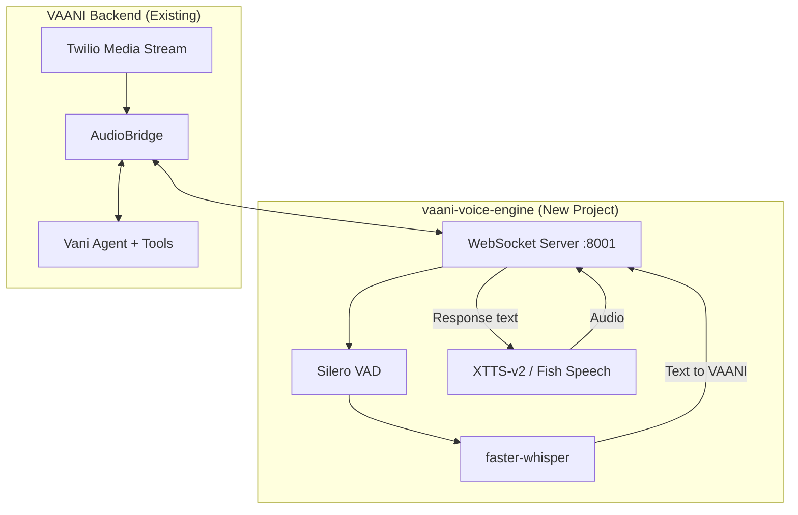

# Custom Voice Pipeline - Implementation Plan

> **Goal**: Build a custom STT ↔ TTS voice engine as a separate project, train on custom voice, integrate with VAANI

---

## Overview

Create a standalone voice processing server (`vaani-voice-engine`) that handles:
- **STT**: Audio → Text (using faster-whisper)
- **TTS**: Text → Audio (using XTTS-v2 or Fish Speech)
- **WebSocket**: Real-time bi-directional audio streaming
- **Voice Training**: Custom voice model trained on your voice

---

## Architecture



---

## Project Structure

```
vaani-voice-engine/
├── app/
│   ├── __init__.py
│   ├── main.py              # FastAPI + WebSocket server
│   ├── config.py            # Settings
│   ├── stt/
│   │   ├── __init__.py
│   │   ├── whisper_client.py   # faster-whisper wrapper
│   │   └── vad.py              # Voice Activity Detection
│   ├── tts/
│   │   ├── __init__.py
│   │   ├── xtts_client.py      # XTTS-v2 wrapper
│   │   └── fish_client.py      # Fish Speech alternative
│   ├── pipeline/
│   │   ├── __init__.py
│   │   └── voice_pipeline.py   # Orchestrator
│   └── audio/
│       ├── __init__.py
│       └── converter.py        # μ-law ↔ PCM conversion
├── models/                   # Downloaded/trained models
│   ├── whisper/
│   └── tts/
├── training/
│   ├── voice_samples/        # Your voice recordings
│   └── train_xtts.ipynb      # Colab notebook
├── tests/
├── requirements.txt
├── Dockerfile
└── README.md
```

---

## Phase 1: Project Setup

### 1.1 Create Project Directory

```bash
mkdir -p vaani-voice-engine/{app/{stt,tts,pipeline,audio},models,training/voice_samples,tests}
cd vaani-voice-engine
python3 -m venv venv && source venv/bin/activate
```

### 1.2 Dependencies

```txt
# Core
fastapi>=0.115.0
uvicorn[standard]>=0.30.0
websockets>=12.0

# STT
faster-whisper>=1.0.0
silero-vad>=1.0.0

# TTS (choose one)
TTS>=0.22.0  # Coqui TTS for XTTS-v2

# Audio Processing
numpy>=1.24.0
scipy>=1.11.0
soundfile>=0.12.0
librosa>=0.10.0

# ML
torch>=2.1.0
torchaudio>=2.1.0

# Utils
python-dotenv>=1.0.0
pydantic-settings>=2.0.0
```

### 1.3 Hardware Requirements

| Component | Mac M4 (Local) | Google Colab (Training) |
|-----------|----------------|-------------------------|
| **faster-whisper** | ✅ MPS acceleration | ✅ T4 GPU |
| **XTTS-v2** | ✅ Works (~2-3s/sentence) | ✅ Fast (training) |
| **RAM** | 16GB+ recommended | Free tier sufficient |

---

## Phase 2: STT (Speech-to-Text)

### 2.1 Voice Activity Detection (VAD)

```python
# app/stt/vad.py
class VoiceActivityDetector:
    """Silero VAD for detecting speech boundaries."""
    
    def __init__(self, sample_rate: int = 16000):
        self.model = load_silero_vad()
        self.sample_rate = sample_rate
        self.buffer = []
        self.speaking = False
        
    def process(self, audio_chunk: bytes) -> Optional[bytes]:
        """Returns complete utterance when speech ends."""
```

### 2.2 Whisper STT

```python
# app/stt/whisper_client.py
class WhisperSTT:
    """faster-whisper for real-time transcription."""
    
    def __init__(self, model_size: str = "large-v3"):
        self.model = WhisperModel(
            model_size,
            device="auto",  # MPS on Mac, CUDA on GPU
            compute_type="float16"
        )
    
    async def transcribe(self, audio: bytes) -> str:
        """Transcribe audio to text."""
        segments, _ = self.model.transcribe(audio, language="hi")
        return " ".join(seg.text for seg in segments)
```

---

## Phase 3: TTS (Text-to-Speech)

### 3.1 XTTS-v2 Client

```python
# app/tts/xtts_client.py
class XTTS_TTS:
    """XTTS-v2 for voice cloning and synthesis."""
    
    def __init__(self, voice_sample: str):
        self.tts = TTS("tts_models/multilingual/multi-dataset/xtts_v2")
        self.speaker_wav = voice_sample
        
    async def synthesize_stream(self, text: str) -> AsyncGenerator[bytes, None]:
        """Stream audio chunks as they're generated."""
        audio = self.tts.tts(
            text=text,
            speaker_wav=self.speaker_wav,
            language="hi"
        )
```

### 3.2 Audio Format Converter

```python
# app/audio/converter.py
def mulaw_to_pcm(mulaw_bytes: bytes) -> bytes:
    """Convert Twilio μ-law to PCM for processing."""

def pcm_to_mulaw(pcm_bytes: bytes) -> bytes:
    """Convert PCM back to μ-law for Twilio."""
```

---

## Phase 4: WebSocket Server

```python
# app/main.py
from fastapi import FastAPI, WebSocket

app = FastAPI()

@app.websocket("/stream")
async def voice_stream(websocket: WebSocket):
    """Bi-directional voice stream: Audio in → Text out."""
    await websocket.accept()
    
    pipeline = VoicePipeline(
        stt=WhisperSTT(),
        tts=XTTS_TTS("models/tts/your_voice.wav"),
        vad=VoiceActivityDetector()
    )
    
    async for message in websocket.iter_bytes():
        text = await pipeline.process_audio(message)
        if text:
            await websocket.send_json({"transcript": text})
    
@app.websocket("/tts")
async def tts_stream(websocket: WebSocket):
    """Text in → Audio out"""
    await websocket.accept()
    
    async for message in websocket.iter_json():
        async for chunk in tts.synthesize_stream(message["text"]):
            await websocket.send_bytes(chunk)
```

---

## Phase 5: Voice Training (Google Colab)

### 5.1 Voice Sample Requirements

| Requirement | Details |
|-------------|---------|
| **Duration** | 10-30 minutes (more = better) |
| **Format** | WAV, 22050 Hz, mono |
| **Content** | Read diverse Hindi/English text |
| **Quality** | Clear audio, minimal background noise |

### 5.2 Colab Training

```python
# training/train_xtts.ipynb

# Cell 1: Install
!pip install TTS

# Cell 2: Upload voice samples
from google.colab import files
uploaded = files.upload()

# Cell 3: Run training
from TTS.api import TTS
tts = TTS("tts_models/multilingual/multi-dataset/xtts_v2")

tts.tts_to_file(
    text="Test sentence",
    speaker_wav="your_voice.wav",
    language="hi",
    file_path="output.wav"
)

# Cell 4: Download trained model
files.download("trained_model.pth")
```

> [!NOTE]
> XTTS-v2 uses zero-shot cloning by default (6-30 sec sample).
> Fine-tuning improves quality but requires 10+ min of audio.

---

## Phase 6: VAANI Integration

### 6.1 Modify AudioBridge

```python
# backend/app/core/audio_bridge.py
class AudioBridge:
    async def connect_voice_engine(self):
        """Connect to custom voice engine instead of OpenAI."""
        self.voice_ws = await websockets.connect(
            "ws://localhost:8001/stream"
        )
    
    async def process_audio(self, audio: bytes):
        """Send to custom engine, get transcription."""
        await self.voice_ws.send(audio)
        response = await self.voice_ws.recv()
        return json.loads(response)["transcript"]
```

### 6.2 Feature Flag

```python
# backend/app/config.py
class Settings(BaseSettings):
    voice_engine: str = "openai"  # "openai" | "custom"
    custom_voice_engine_url: str = "ws://localhost:8001"
```

---

## Verification Plan

### Automated Tests

| Test | Command | Verifies |
|------|---------|----------|
| VAD | `pytest tests/test_vad.py` | Speech detection |
| STT | `pytest tests/test_stt.py` | Transcription |
| TTS | `pytest tests/test_tts.py` | Audio generation |
| WebSocket | `pytest tests/test_websocket.py` | End-to-end |

### Manual Testing

```bash
# Start voice engine
cd vaani-voice-engine && uvicorn app.main:app --port 8001

# Start VAANI
cd v2/backend && uvicorn app.main:app --port 8000

# Test with feature flag
VOICE_ENGINE=custom curl -X POST http://localhost:8000/voice/call-me ...
```

---

## Timeline

| Week | Tasks |
|------|-------|
| **1** | Project setup, faster-whisper + VAD |
| **2** | XTTS-v2 setup, WebSocket server |
| **3** | Voice training on Colab |
| **4** | VAANI integration |
| **5** | Optimization, latency tuning |
| **6** | Production deployment |
