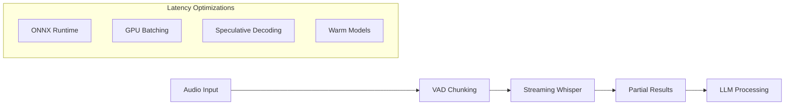
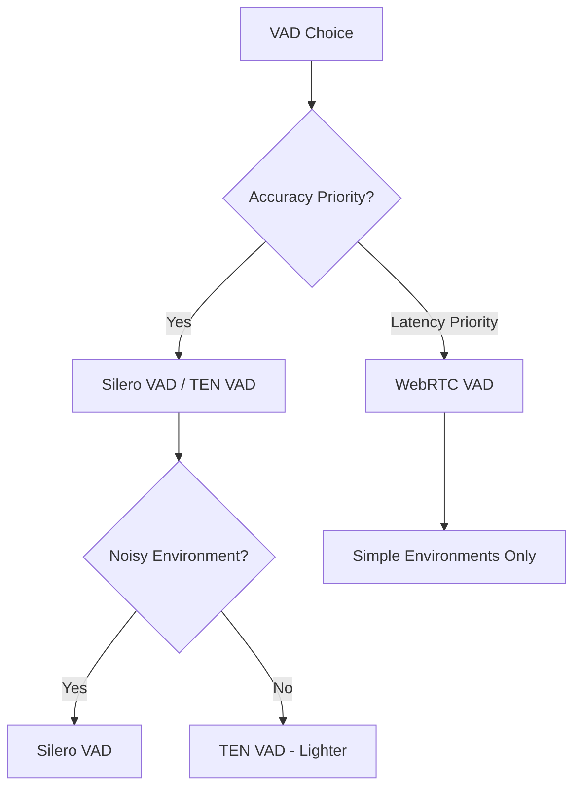
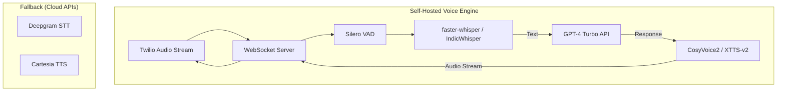

# Vaani Engine - Research Analysis

> **Goal**: Deep analysis of open-source STT, TTS, and VAD models for building production-grade, minimal-latency voice AI infrastructure

---

## Executive Summary

This document provides comprehensive research on building your own voice infrastructure using open-source models. The goal is to replicate OpenAI Realtime API capabilities with support for **Hindi, English, and Hinglish**, prioritizing **minimal latency** and **production-grade reliability**.

### Key Findings

| Component | Recommended Primary | Recommended Fallback | Latency Target |
|-----------|---------------------|----------------------|----------------|
| **STT** | faster-whisper + AI4Bharat | Deepgram API | ~150-300ms |
| **TTS** | CosyVoice2 / Chatterbox | Cartesia API | ~100-200ms |
| **VAD** | Silero VAD / TEN VAD | WebRTC VAD | <30ms |

---

## 1. Speech-to-Text (STT) Analysis

### 1.1 Open-Source STT Models Comparison

| Model | Latency | Hindi Support | Accuracy | VRAM | License | Production Ready |
|-------|---------|---------------|----------|------|---------|------------------|
| **faster-whisper** (large-v3) | ~300-500ms | ✅ Excellent | 94-96% WER | 10GB | MIT | ✅ Yes |
| **Whisper Large V3 Turbo** | ~200-400ms | ✅ Excellent | 93-95% WER | 6GB | MIT | ✅ Yes |
| **Distil-Whisper** | ~150-300ms | ⚠️ Reduced | 90-93% WER | 3-4GB | MIT | ✅ Yes |
| **Parakeet TDT (NVIDIA)** | ~50-100ms ⚡ | ❌ English only | 95%+ WER | 8GB | Apache 2.0 | ✅ Yes |
| **AI4Bharat IndicConformers** | ~200-400ms | ✅ 22 Indian langs | 92-95% WER | 4-6GB | MIT | ✅ Yes |
| **Kyutai 2.6B** | ~100-250ms | ⚠️ Limited | 94% WER | 12GB | Apache 2.0 | ⚠️ New |
| **Vosk** | ~100-200ms | ✅ Hindi available | 85-90% WER | <1GB | Apache 2.0 | ✅ Yes |

### 1.2 Hindi/Indian Language STT Deep Dive

#### AI4Bharat IndicConformers (IIT Madras)
- **Languages**: All 22 official Indian languages + Hinglish
- **Models Available**:
  - `IndicWav2Vec` - Self-supervised pre-trained
  - `IndicWhisper` - Whisper fine-tuned on Indian data
  - `IndicConformers` - Production-optimized Conformer architecture
- **Datasets**: IndicVoices, MahaDhwani, Nirantar, Lahaja (Hindi accents)
- **License**: MIT (fully open-source)
- **Integration**: Available on HuggingFace, ONNX export supported

> [!TIP]
> **Recommendation for Hindi**: Use **AI4Bharat IndicWhisper** for best Hindi/Hinglish accuracy, with **faster-whisper** as fallback for code-switching.

#### Whisper Performance on Indian Languages
- Hindi WER: ~8-12% (good)
- Hinglish (code-mixed): ~15-20% (moderate)
- Indian English accents: ~5-8% (excellent)

### 1.3 STT Latency Optimization Techniques



1. **Use Streaming Mode**: Process audio chunks as they arrive (30ms frames)
2. **VAD Pre-filtering**: Only send speech segments to STT
3. **Partial Transcriptions**: Stream partial results to LLM before utterance ends
4. **Model Warm-up**: Keep models loaded in GPU memory
5. **ONNX Optimization**: Convert to ONNX for 2-3x faster inference
6. **Quantization**: Use INT8/FP16 for reduced memory and faster inference

---

## 2. Text-to-Speech (TTS) Analysis

### 2.1 Open-Source TTS Models Comparison

| Model | Latency (TTFB) | Hindi Support | Voice Clone | Quality | VRAM | License |
|-------|----------------|---------------|-------------|---------|------|---------|
| **CosyVoice2-0.5B** | ~150ms ⚡ | ✅ Yes | ✅ Zero-shot | ⭐⭐⭐⭐⭐ | 4GB | Apache 2.0 |
| **Chatterbox-Turbo** | ~200ms ⚡ | ⚠️ English only | ✅ Yes | ⭐⭐⭐⭐⭐ | 4GB | MIT |
| **XTTS-v2** | ~300-500ms | ✅ 17 langs | ✅ 6-30sec sample | ⭐⭐⭐⭐⭐ | 4-6GB | CPAL |
| **Fish Speech V1.5** | ~200-400ms | ✅ 8 langs | ✅ 3-10sec sample | ⭐⭐⭐⭐⭐ | 4GB | Apache 2.0 |
| **Kokoro** | ~100ms ⚡ | ⚠️ Limited | ❌ No | ⭐⭐⭐⭐ | <1GB | MIT |
| **MeloTTS** | ~150ms | ✅ Multiple langs | ❌ No | ⭐⭐⭐⭐ | <1GB | MIT |
| **VITS/VITS2** | ~200-300ms | ✅ Trainable | ✅ Fine-tune | ⭐⭐⭐⭐ | 2-4GB | MIT |
| **Dia2** | ~100-150ms ⚡ | ⚠️ Limited | ❌ No | ⭐⭐⭐⭐ | 2GB | Apache 2.0 |

### 2.2 Detailed Model Analysis

#### CosyVoice2-0.5B (Recommended for Hindi)
- **Streaming Latency**: 150ms (first audio chunk)
- **Languages**: Chinese, English, Japanese, Korean, + trainable
- **Voice Cloning**: Zero-shot with 3-10 second reference
- **Features**: Emotion control, accent preservation
- **Architecture**: Flow-matching TTS with streaming support
- **Why Recommended**: Ultra-low latency + multilingual + streaming

#### XTTS-v2 (Best Voice Cloning)
- **Languages**: 17 languages including Hindi
- **Voice Cloning**: 6-30 seconds audio sample
- **Streaming**: Yes, sub-200ms latency possible
- **Fine-tuning**: Supported for custom voices
- **Note**: Coqui shut down but open-source community maintains it

#### Chatterbox-Turbo (Best for English)
- **Latency**: Sub-200ms inference
- **Features**: Emotion exaggeration, paralinguistic tags
- **Voice Cloning**: Supported
- **Currently**: #1 trending TTS on HuggingFace
- **Limitation**: English-only (fine-tuning needed for Hindi)

#### Fish Speech V1.5
- **Architecture**: DualAR (dual auto-regressive)
- **Voice Cloning**: 3-10 second audio clips
- **Emotion Control**: Yes
- **Languages**: 8 languages
- **License**: Apache 2.0 (commercial-friendly)

### 2.3 TTS for Hindi/Indian Languages

| Option | Approach | Effort | Quality |
|--------|----------|--------|---------|
| **XTTS-v2** | Native Hindi support | Low | ⭐⭐⭐⭐⭐ |
| **CosyVoice2 + Fine-tune** | Fine-tune on Hindi data | Medium | ⭐⭐⭐⭐⭐ |
| **VITS2 + Training** | Train from scratch | High | ⭐⭐⭐⭐ |
| **AI4Bharat IndicTTS** | Pre-trained Hindi models | Low | ⭐⭐⭐⭐ |

> [!IMPORTANT]
> **For Production Hindi TTS**: Start with **XTTS-v2** (native Hindi), plan to fine-tune **CosyVoice2** for better latency once stable.

### 2.4 TTS Latency Optimization

1. **Streaming Synthesis**: Generate audio chunk-by-chunk
2. **First Token Optimization**: Prioritize TTFB (Time to First Byte)
3. **Sentence Chunking**: Split long responses into sentences
4. **Audio Caching**: Cache common phrases
5. **GPU Memory**: Keep model warm on GPU
6. **Vocoder Optimization**: Use HiFi-GAN or Vocos for fast waveform generation

---

## 3. Voice Activity Detection (VAD) Analysis

### 3.1 VAD Models Comparison

| Model | Latency | Accuracy | Size | Features | License |
|-------|---------|----------|------|----------|---------|
| **Silero VAD** | <1ms/chunk ⚡ | 95%+ | ~2MB | Noise robust, multilingual | MIT |
| **TEN VAD** | <1ms/chunk ⚡ | 96%+ | ~1MB | Frame-level precision | Apache 2.0 |
| **WebRTC VAD** | <0.5ms ⚡ | 85-90% | <1MB | Lightweight, battle-tested | BSD |
| **FunASR VAD** | ~5ms | 94%+ | ~10MB | Chinese-optimized | Apache 2.0 |
| **Cobra VAD** (Picovoice) | <1ms | 98%+ | ~1MB | Commercial, edge-optimized | Commercial |

### 3.2 VAD Selection Criteria



### 3.3 Recommended: Silero VAD

**Why Silero VAD:**
- Processes 30ms chunks in <1ms on CPU
- Works on Raspberry Pi and edge devices
- Trained on multiple languages (no Hindi-specific issues)
- ONNX export for maximum portability
- Active community maintenance

**Implementation Notes:**
- Frame size: 30ms recommended
- Threshold: 0.5-0.7 for speech detection
- Minimum speech duration: 250ms
- Silence padding: 500-1000ms before end-of-utterance

---

## 4. Production Architecture Recommendations

### 4.1 Recommended Stack (Low Latency + Hindi)



### 4.2 Latency Budget

| Component | Target | Self-Hosted | Cloud Fallback |
|-----------|--------|-------------|----------------|
| **VAD** | <30ms | ~10ms | N/A |
| **STT** | <300ms | ~200-400ms | ~100-200ms (Deepgram) |
| **LLM** | <400ms | ~300-500ms (GPT-4) | Same |
| **TTS** | <200ms | ~150-300ms | ~100ms (Cartesia) |
| **Total** | <800ms | ~700-1200ms | ~600-900ms |

> [!WARNING]
> OpenAI Realtime is ~400ms end-to-end. Self-hosted will be ~700-1200ms. Optimize aggressively.

### 4.3 Hybrid Architecture (Recommended)

```python
# Pseudo-code for hybrid fallback
class VoicePipeline:
    def __init__(self):
        self.primary_stt = SelfHostedWhisper()
        self.fallback_stt = DeepgramClient()
        
        self.primary_tts = CosyVoice2()
        self.fallback_tts = CartesiaClient()
    
    async def transcribe(self, audio):
        try:
            return await asyncio.wait_for(
                self.primary_stt.transcribe(audio),
                timeout=0.5  # 500ms timeout
            )
        except asyncio.TimeoutError:
            return await self.fallback_stt.transcribe(audio)
```

---

## 5. Hardware Requirements

### 5.1 GPU Requirements by Configuration

| Configuration | GPU | VRAM | Monthly Cost |
|---------------|-----|------|--------------|
| **Minimal** (Whisper-medium + MeloTTS) | RTX 3060 | 12GB | ~$50/mo |
| **Balanced** (Whisper-large + XTTS) | RTX 3080 | 10GB | ~$100/mo |
| **Optimal** (Whisper-large + CosyVoice2) | RTX 4090 | 24GB | ~$200/mo |
| **Production** (Multi-model) | A100 40GB | 40GB | ~$300-500/mo |

### 5.2 Cloud GPU Providers

| Provider | GPU | Price/Hour | Best For |
|----------|-----|------------|----------|
| **RunPod** | RTX 4090 | ~$0.44 | Development |
| **Lambda Labs** | A100 | ~$1.10 | Production |
| **Vast.ai** | Various | ~$0.20-0.80 | Cost-sensitive |
| **Modal** | A100 | Pay-per-use | Serverless |

### 5.3 Local Development (Your M4 Mac)

| Model | Mac Compatibility | Performance |
|-------|-------------------|-------------|
| faster-whisper | ✅ MPS acceleration | ~2-3x realtime |
| XTTS-v2 | ✅ Works | ~3-5s per sentence |
| CosyVoice2 | ⚠️ CPU only | Slow |
| Silero VAD | ✅ Excellent | <1ms |

> [!NOTE]
> For development: Use Mac locally. For training/production: Use cloud GPUs.

---

## 6. Open-Source vs Build Decision Matrix

### 6.1 STT Decision

| Requirement | Use Existing | Build/Fine-tune |
|-------------|--------------|-----------------|
| English only | faster-whisper ✅ | Not needed |
| Hindi/Hinglish | IndicWhisper ✅ | Fine-tune on domain data |
| Ultra-low latency | Parakeet TDT ✅ | Not needed |
| Regional languages | IndicConformers ✅ | Collect data + fine-tune |

**Verdict**: Use existing open-source (faster-whisper + IndicWhisper). Fine-tune only if domain-specific accuracy needed.

### 6.2 TTS Decision

| Requirement | Use Existing | Build/Fine-tune |
|-------------|--------------|-----------------|
| English voices | Chatterbox ✅ | Not needed |
| Hindi voices | XTTS-v2 ✅ | Fine-tune for better quality |
| Voice cloning | XTTS-v2 / CosyVoice2 ✅ | Train on custom voice |
| Ultra-low latency | CosyVoice2 / Kokoro ✅ | Not needed |
| Regional languages | XTTS-v2 (limited) | Train VITS2 on data |

**Verdict**: Start with XTTS-v2. Fine-tune CosyVoice2 for better latency. Build only for unsupported languages.

### 6.3 VAD Decision

| Requirement | Use Existing | Build |
|-------------|--------------|-------|
| General use | Silero VAD ✅ | Not needed |
| Ultra-low latency | TEN VAD ✅ | Not needed |
| Embedded/Edge | WebRTC VAD ✅ | Not needed |

**Verdict**: Always use existing. No need to build VAD.

---

## 7. Risk Assessment

| Risk | Probability | Impact | Mitigation |
|------|-------------|--------|------------|
| Latency exceeds target | High | High | Hybrid fallback to APIs |
| Hindi TTS quality issues | Medium | Medium | Fine-tune on Indian voice data |
| GPU costs escalate | Medium | Medium | Auto-scaling, spot instances |
| Model maintenance burden | Medium | Low | Use well-maintained forks |
| Coqui/XTTS abandonment | Low | Medium | Fish Speech as backup |

---

## 8. Recommendations Summary

### Primary Stack
1. **STT**: `faster-whisper` (large-v3) + `IndicWhisper` for Hindi
2. **TTS**: `XTTS-v2` (Hindi) → Migrate to `CosyVoice2` (lower latency)
3. **VAD**: `Silero VAD` (best accuracy/latency balance)
4. **LLM**: GPT-4 Turbo (cloud API)

### Fallback Stack
1. **STT**: Deepgram Nova-3 API
2. **TTS**: Cartesia API
3. **LLM**: Same (GPT-4 Turbo)

### Development Phases
1. **Phase 1**: Set up faster-whisper + XTTS-v2 + Silero VAD
2. **Phase 2**: Integrate IndicWhisper for Hindi improvement
3. **Phase 3**: Add hybrid fallback to APIs
4. **Phase 4**: Fine-tune TTS on custom voice
5. **Phase 5**: Optimize for sub-800ms latency
6. **Phase 6**: Production deployment + monitoring

---

## References

### STT Models
- [faster-whisper](https://github.com/SYSTRAN/faster-whisper)
- [AI4Bharat](https://ai4bharat.iitm.ac.in/)
- [Parakeet TDT](https://github.com/NVIDIA/NeMo)
- [Vosk](https://alphacephei.com/vosk/)

### TTS Models
- [XTTS-v2](https://github.com/coqui-ai/TTS)
- [CosyVoice2](https://github.com/FunAudioLLM/CosyVoice)
- [Chatterbox](https://github.com/resemble-ai/chatterbox)
- [Fish Speech](https://github.com/fishaudio/fish-speech)

### VAD Models
- [Silero VAD](https://github.com/snakers4/silero-vad)
- [TEN VAD](https://github.com/TEN-Agent/TEN-VAD)

### Frameworks
- [Pipecat](https://github.com/pipecat-ai/pipecat) - Voice AI orchestration
- [LiveKit Agents](https://github.com/livekit/agents) - WebRTC + Voice AI
