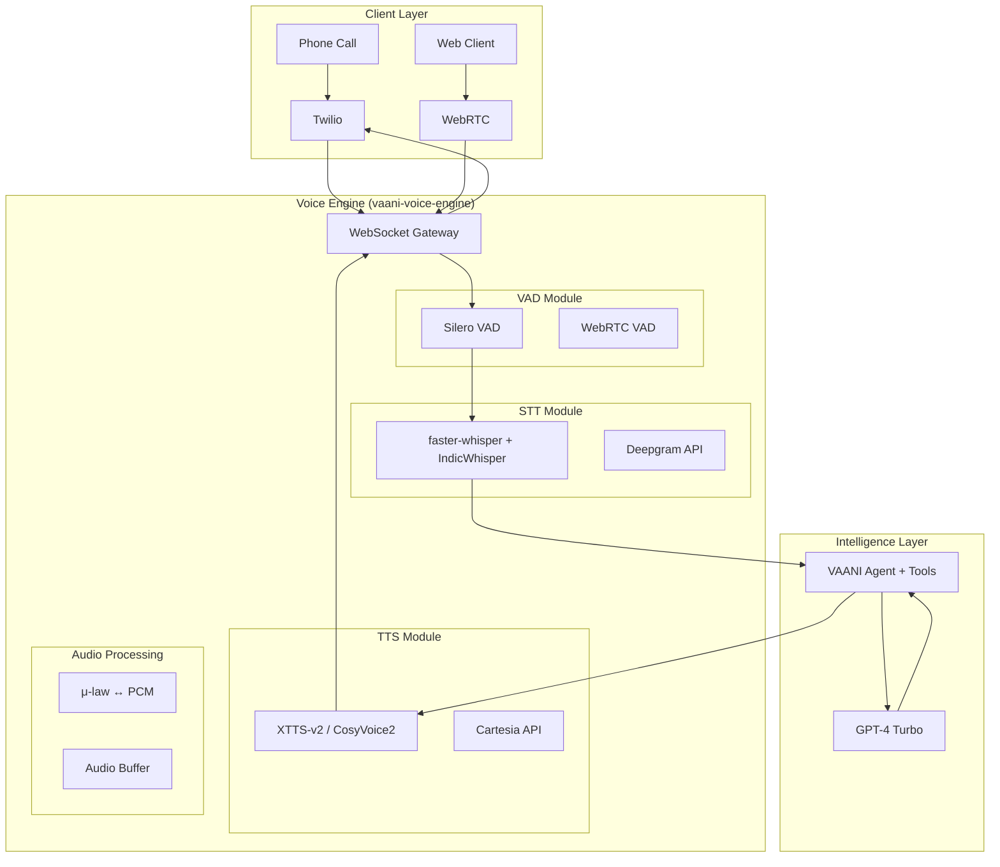
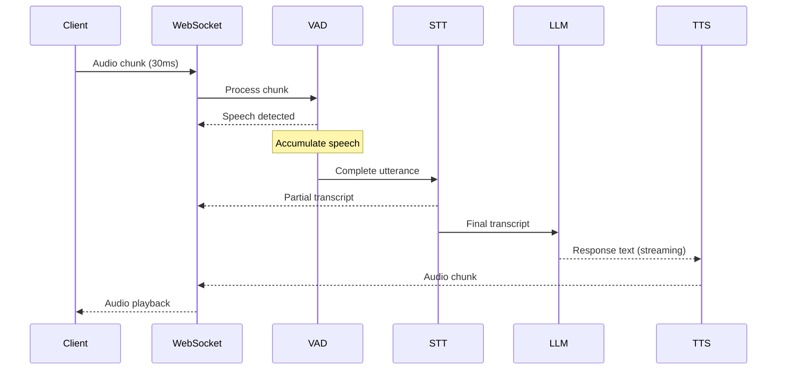

# Vaani Engine - Implementation Plan

> **Goal**: Build production-grade, minimal-latency voice AI infrastructure using open-source STT, TTS, and VAD models with Hindi/Hinglish support

---

## Project Overview

### Objectives
1. **Replicate OpenAI Realtime API** functionality with open-source models
2. **Support Hindi, English, and Hinglish** with natural voice quality
3. **Achieve minimal latency** (<800ms target, stretch goal <600ms)
4. **Production-grade reliability** with hybrid fallback to cloud APIs
5. **Voice cloning capability** (future phase)

### Requirements Summary (From User)
| Requirement | Decision |
|-------------|----------|
| **Languages** | English, Hindi, Hinglish → Regional expansion later |
| **Deployment** | Local development + Cloud GPU hosting |
| **LLM** | GPT-4 Turbo (cloud API) |
| **Concurrency** | Start small, scale to ~600 calls/month/member |
| **Fallback** | Yes, structured hybrid approach |
| **Budget** | ~$100/month initially, scale with production |
| **Voice Cloning** | Future phase, not priority |

---

## System Architecture

### High-Level Architecture



### Latency Target Breakdown

| Stage | Target | Stretch Goal | Technique |
|-------|--------|--------------|-----------|
| Audio capture → VAD | 30ms | 20ms | Streaming chunks |
| VAD → End of speech | 300ms | 200ms | Smart silence detection |
| STT processing | 300ms | 200ms | GPU + streaming partials |
| LLM response (TTFT) | 200ms | 150ms | Prompt optimization |
| TTS synthesis (TTFB) | 200ms | 150ms | Streaming chunks |
| Audio playback start | 50ms | 30ms | Pre-buffering |
| **Total E2E** | **~800ms** | **~600ms** | — |

---

## Project Structure

```
vaani-engine/
├── app/
│   ├── __init__.py
│   ├── main.py                     # FastAPI application entry
│   ├── config.py                   # Settings and environment
│   │
│   ├── core/
│   │   ├── __init__.py
│   │   ├── voice_pipeline.py       # Main orchestrator
│   │   ├── session_manager.py      # Concurrent session handling
│   │   └── metrics.py              # Latency monitoring
│   │
│   ├── vad/
│   │   ├── __init__.py
│   │   ├── base.py                 # Abstract VAD interface
│   │   ├── silero_vad.py           # Silero VAD implementation
│   │   └── webrtc_vad.py           # WebRTC fallback
│   │
│   ├── stt/
│   │   ├── __init__.py
│   │   ├── base.py                 # Abstract STT interface
│   │   ├── whisper_stt.py          # faster-whisper implementation
│   │   ├── indic_stt.py            # AI4Bharat IndicWhisper
│   │   └── deepgram_stt.py         # Deepgram API fallback
│   │
│   ├── tts/
│   │   ├── __init__.py
│   │   ├── base.py                 # Abstract TTS interface
│   │   ├── xtts_tts.py             # XTTS-v2 implementation
│   │   ├── cosyvoice_tts.py        # CosyVoice2 (future)
│   │   └── cartesia_tts.py         # Cartesia API fallback
│   │
│   ├── audio/
│   │   ├── __init__.py
│   │   ├── converter.py            # μ-law ↔ PCM conversion
│   │   ├── buffer.py               # Audio buffering
│   │   └── resampler.py            # Sample rate conversion
│   │
│   └── api/
│       ├── __init__.py
│       ├── websocket.py            # WebSocket endpoints
│       └── health.py               # Health check endpoints
│
├── models/                         # Downloaded model files
│   ├── whisper/
│   ├── indic/
│   ├── tts/
│   └── vad/
│
├── training/                       # Voice training resources
│   ├── voice_samples/
│   ├── notebooks/
│   │   ├── train_xtts.ipynb
│   │   └── finetune_cosyvoice.ipynb
│   └── scripts/
│
├── tests/
│   ├── __init__.py
│   ├── test_vad.py
│   ├── test_stt.py
│   ├── test_tts.py
│   ├── test_pipeline.py
│   └── test_latency.py
│
├── scripts/
│   ├── download_models.py
│   ├── benchmark_latency.py
│   └── test_audio.py
│
├── docker/
│   ├── Dockerfile
│   ├── Dockerfile.gpu
│   └── docker-compose.yml
│
├── requirements.txt
├── requirements-dev.txt
├── pyproject.toml
├── .env.example
└── README.md
```

---

## Implementation Phases

### Phase 1: Project Foundation (Week 1)

#### 1.1 Project Setup
- [ ] Create project directory structure
- [ ] Set up Python 3.11+ virtual environment
- [ ] Install PyTorch with CUDA/MPS support
- [ ] Create configuration management (pydantic-settings)
- [ ] Set up logging and metrics infrastructure

#### 1.2 Core Dependencies
```txt
# Core Framework
fastapi>=0.115.0
uvicorn[standard]>=0.30.0
websockets>=12.0
pydantic-settings>=2.0.0

# Audio Processing
numpy>=1.24.0
scipy>=1.11.0
soundfile>=0.12.0
librosa>=0.10.0
audioop-lts>=0.2.0  # For μ-law conversion (Python 3.13+)

# ML Framework
torch>=2.1.0
torchaudio>=2.1.0
onnxruntime>=1.16.0

# Utilities
python-dotenv>=1.0.0
structlog>=24.0.0
prometheus-client>=0.19.0
```

#### 1.3 Audio Utilities
- [ ] Implement μ-law ↔ PCM conversion
- [ ] Implement audio buffering with circular buffer
- [ ] Implement sample rate conversion (8kHz ↔ 16kHz ↔ 22kHz)
- [ ] Write audio utility tests

---

### Phase 2: VAD Implementation (Week 1-2)

#### 2.1 Silero VAD Integration
- [ ] Download Silero VAD model
- [ ] Implement VAD wrapper class
- [ ] Configure speech/silence thresholds
- [ ] Implement end-of-utterance detection
- [ ] Add minimum speech duration filter

#### 2.2 VAD Interface
```python
class VADInterface(ABC):
    @abstractmethod
    async def process_chunk(self, audio: bytes) -> VADResult:
        """Process audio chunk, return speech probability."""
        pass
    
    @abstractmethod
    async def get_utterance(self) -> Optional[bytes]:
        """Return complete utterance when speech ends."""
        pass
```

#### 2.3 VAD Configuration
```python
class VADConfig(BaseSettings):
    model_path: str = "models/vad/silero_vad.onnx"
    sample_rate: int = 16000
    frame_duration_ms: int = 30
    speech_threshold: float = 0.5
    silence_duration_ms: int = 700
    min_speech_duration_ms: int = 250
```

---

### Phase 3: STT Implementation (Week 2-3)

#### 3.1 faster-whisper Setup
- [ ] Download Whisper large-v3 model
- [ ] Implement faster-whisper wrapper
- [ ] Configure for GPU/MPS acceleration
- [ ] Implement streaming transcription
- [ ] Add language detection

#### 3.2 IndicWhisper Integration
- [ ] Download AI4Bharat IndicWhisper model
- [ ] Implement Hindi/Hinglish optimized path
- [ ] Add language routing (Hindi vs English)

#### 3.3 Deepgram Fallback
- [ ] Implement Deepgram API client
- [ ] Add timeout-based fallback logic
- [ ] Implement retry with exponential backoff

#### 3.4 STT Interface
```python
class STTInterface(ABC):
    @abstractmethod
    async def transcribe(self, audio: bytes, language: str = "auto") -> TranscriptionResult:
        pass
    
    @abstractmethod
    async def transcribe_stream(self, audio_stream: AsyncIterator[bytes]) -> AsyncIterator[PartialTranscription]:
        pass
```

---

### Phase 4: TTS Implementation (Week 3-4)

#### 4.1 XTTS-v2 Setup
- [ ] Download XTTS-v2 model
- [ ] Implement TTS wrapper class
- [ ] Configure for Hindi language
- [ ] Implement streaming audio output
- [ ] Add voice sample management

#### 4.2 TTS Interface
```python
class TTSInterface(ABC):
    @abstractmethod
    async def synthesize(self, text: str, voice_id: str = "default") -> bytes:
        pass
    
    @abstractmethod
    async def synthesize_stream(self, text: str, voice_id: str = "default") -> AsyncIterator[bytes]:
        pass
```

#### 4.3 Cartesia Fallback
- [ ] Implement Cartesia API client
- [ ] Add timeout-based fallback
- [ ] Match voice characteristics

---

### Phase 5: Pipeline Integration (Week 4-5)

#### 5.1 Voice Pipeline Orchestrator
- [ ] Implement VoicePipeline class
- [ ] Add concurrent session management
- [ ] Implement streaming audio flow
- [ ] Add interruption handling (barge-in)

#### 5.2 WebSocket Server
- [ ] Implement bidirectional WebSocket endpoint
- [ ] Add message protocol (JSON + binary audio)
- [ ] Handle connection lifecycle
- [ ] Add authentication/session tokens

#### 5.3 Pipeline Flow


---

### Phase 6: VAANI Integration (Week 5-6)

#### 6.1 Integration with Existing VAANI
- [ ] Create voice engine client in VAANI backend
- [ ] Modify AudioBridge to use new engine
- [ ] Add feature flag for engine selection
- [ ] Update configuration management

#### 6.2 Feature Flag Implementation
```python
# backend/app/config.py
class Settings(BaseSettings):
    voice_engine: Literal["openai", "custom", "hybrid"] = "openai"
    custom_voice_engine_url: str = "ws://localhost:8001"
    voice_engine_timeout_ms: int = 500
```

---

### Phase 7: Testing & Optimization (Week 6-7)

#### 7.1 Unit Tests
- [ ] VAD accuracy tests
- [ ] STT transcription tests
- [ ] TTS synthesis tests
- [ ] Audio conversion tests

#### 7.2 Integration Tests
- [ ] Full pipeline latency tests
- [ ] Concurrent session tests
- [ ] Fallback mechanism tests
- [ ] Error recovery tests

#### 7.3 Latency Benchmarking
```python
# scripts/benchmark_latency.py
async def benchmark_pipeline():
    results = {
        "vad_latency": [],
        "stt_latency": [],
        "tts_latency": [],
        "e2e_latency": [],
    }
    # Run 100 sample utterances
    # Measure p50, p90, p99 latencies
```

---

### Phase 8: Production Deployment (Week 7-8)

#### 8.1 Containerization
- [ ] Create GPU-enabled Dockerfile
- [ ] Set up docker-compose for local dev
- [ ] Configure model volume mounting

#### 8.2 Cloud Deployment
- [ ] Set up RunPod/Lambda Labs GPU instance
- [ ] Configure auto-scaling (future)
- [ ] Set up monitoring (Prometheus + Grafana)
- [ ] Configure health checks

#### 8.3 Production Checklist
- [ ] SSL/TLS configuration
- [ ] Rate limiting
- [ ] Error alerting
- [ ] Log aggregation
- [ ] Backup voice (Cartesia) verified

---

## Verification Plan

### Automated Tests

| Test Suite | Command | Verifies |
|------------|---------|----------|
| VAD Tests | `pytest tests/test_vad.py -v` | Speech detection accuracy |
| STT Tests | `pytest tests/test_stt.py -v` | Transcription accuracy |
| TTS Tests | `pytest tests/test_tts.py -v` | Audio generation |
| Pipeline Tests | `pytest tests/test_pipeline.py -v` | End-to-end flow |
| Latency Tests | `pytest tests/test_latency.py -v` | Performance benchmarks |

### Manual Testing

1. **Local Pipeline Test**
   ```bash
   # Start voice engine
   cd vaani-voice-engine
   uvicorn app.main:app --host 0.0.0.0 --port 8001
   
   # Test with sample audio
   python scripts/test_audio.py --input sample.wav
   ```

2. **Phone Call Test**
   - Start VAANI with `VOICE_ENGINE=custom`
   - Make test call via Twilio
   - Verify conversation flows naturally
   - Measure perceived latency

3. **Hindi/Hinglish Test**
   - Test with Hindi audio samples
   - Test with code-mixed Hinglish
   - Verify accurate transcription and natural TTS

---

## Timeline Summary

| Week | Phase | Deliverables |
|------|-------|--------------|
| 1 | Foundation | Project setup, audio utilities |
| 1-2 | VAD | Silero VAD integration, tests |
| 2-3 | STT | faster-whisper + IndicWhisper |
| 3-4 | TTS | XTTS-v2, streaming output |
| 4-5 | Pipeline | Full orchestration, WebSocket |
| 5-6 | Integration | VAANI connection, feature flags |
| 6-7 | Testing | Benchmarks, optimization |
| 7-8 | Production | Deployment, monitoring |

**Total: 8 weeks**

---

## Budget Estimation

### Development Phase
| Item | Monthly Cost |
|------|--------------|
| RunPod GPU (development) | ~$50 |
| Deepgram API (fallback testing) | ~$10 |
| Cartesia API (fallback testing) | ~$10 |
| **Total Development** | **~$70/month** |

### Production Phase (per 600 calls/month)
| Item | Monthly Cost |
|------|--------------|
| GPU hosting (RTX 4090) | ~$100-150 |
| Fallback APIs (10% traffic) | ~$20 |
| Monitoring/Infrastructure | ~$10 |
| **Total Production** | **~$130-180/month** |

---

## Success Criteria

| Metric | Target | Measurement |
|--------|--------|-------------|
| E2E Latency (p50) | <800ms | Automated benchmark |
| E2E Latency (p90) | <1200ms | Automated benchmark |
| STT Accuracy (English) | >95% | WER measurement |
| STT Accuracy (Hindi) | >90% | WER measurement |
| TTS Quality (MOS) | >3.5/5 | User feedback |
| Uptime | >99% | Monitoring |
| Fallback Rate | <10% | Metrics |
