# Vaani Engine - System Architecture

> **Purpose**: Technical architecture documentation for production-grade voice AI infrastructure

---

## 1. System Overview

### 1.1 High-Level Architecture

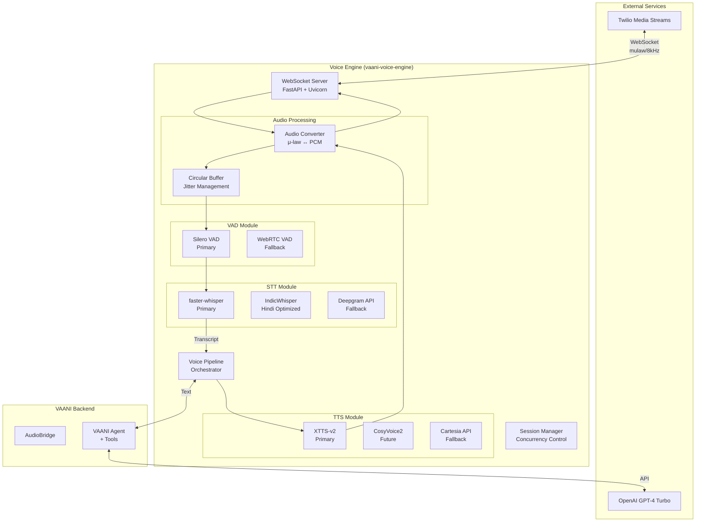

### 1.2 Component Responsibilities

| Component | Responsibility | Technology |
|-----------|----------------|------------|
| **WebSocket Server** | Connection management, audio streaming | FastAPI, websockets |
| **Audio Converter** | μ-law ↔ PCM, sample rate conversion | NumPy, SciPy |
| **Circular Buffer** | Jitter management, audio accumulation | Python deque |
| **VAD** | Speech detection, utterance boundaries | Silero VAD, ONNX |
| **STT** | Audio → Text transcription | faster-whisper, PyTorch |
| **TTS** | Text → Audio synthesis | XTTS-v2, PyTorch |
| **Pipeline** | Flow orchestration, state management | asyncio |
| **Session Manager** | Concurrent call handling | asyncio semaphore |

---

## 2. Data Flow

### 2.1 Audio Input Flow (User Speech → Transcript)

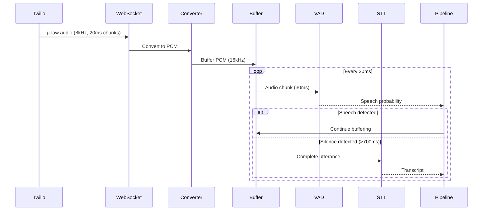

### 2.2 Audio Output Flow (Response → User)

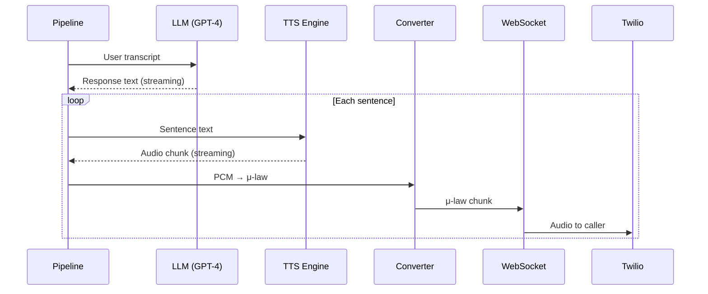

---

## 3. Module Architecture

### 3.1 VAD Module

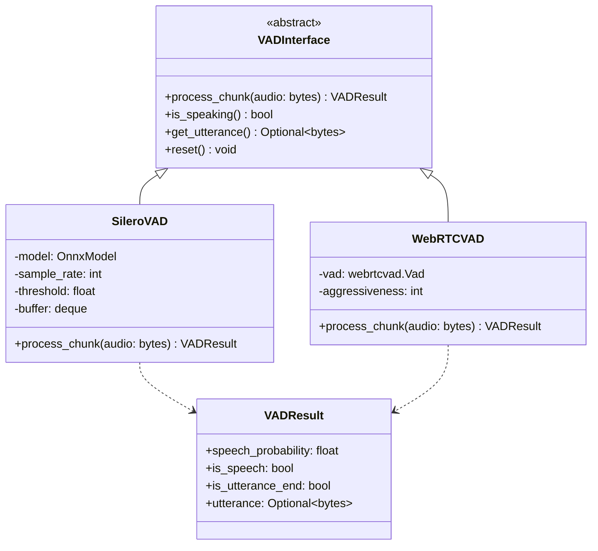

### 3.2 STT Module

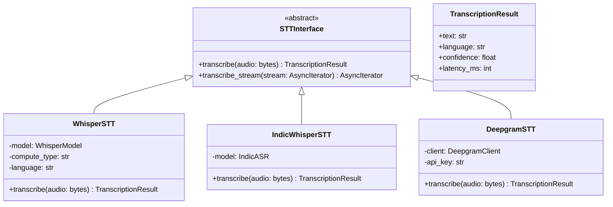

### 3.3 TTS Module

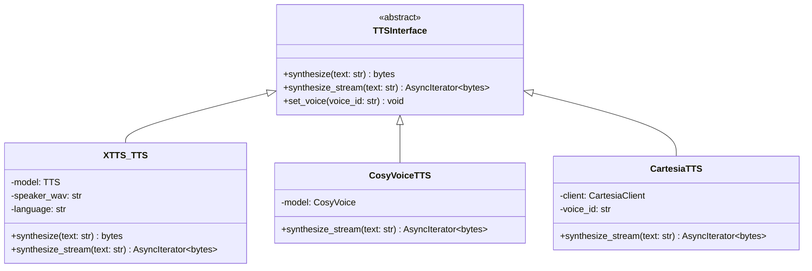

---

## 4. Voice Pipeline State Machine

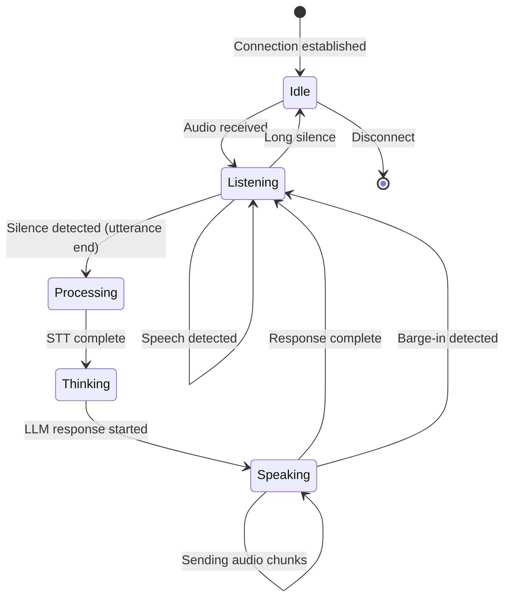

### State Descriptions

| State | Description | Timeout |
|-------|-------------|---------|
| **Idle** | Connected, waiting for audio | 30s → disconnect |
| **Listening** | Receiving user speech | 10s → idle |
| **Processing** | Running STT on utterance | 5s → timeout error |
| **Thinking** | Waiting for LLM response | 10s → timeout error |
| **Speaking** | Streaming TTS audio | Until complete |

---

## 5. Hybrid Fallback Architecture

### 5.1 Fallback Decision Flow

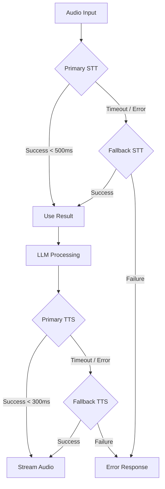

### 5.2 Fallback Configuration

```python
class FallbackConfig(BaseSettings):
    # STT Fallback
    stt_primary: str = "whisper"          # whisper | indic
    stt_fallback: str = "deepgram"        # deepgram | assemblyai
    stt_timeout_ms: int = 500
    stt_retry_count: int = 1
    
    # TTS Fallback
    tts_primary: str = "xtts"             # xtts | cosyvoice
    tts_fallback: str = "cartesia"        # cartesia | elevenlabs
    tts_timeout_ms: int = 300
    tts_retry_count: int = 1
    
    # Circuit Breaker
    failure_threshold: int = 5
    recovery_timeout_s: int = 30
```

---

## 6. Concurrency Model

### 6.1 Session Architecture

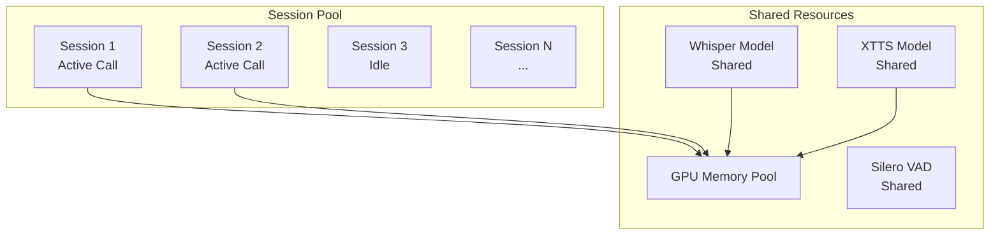

### 6.2 Resource Limits

| Resource | Limit | Reasoning |
|----------|-------|-----------|
| Max concurrent sessions | 10-20 | GPU memory bound |
| Audio buffer per session | 30 seconds | Memory efficiency |
| Session timeout | 10 minutes | Call duration limit |
| GPU memory ceiling | 80% of available | Leave headroom |

---

## 7. Audio Format Specifications

### 7.1 Format Standards

| Stage | Format | Sample Rate | Bit Depth | Channels |
|-------|--------|-------------|-----------|----------|
| Twilio Input | μ-law | 8 kHz | 8-bit | Mono |
| Internal Processing | PCM | 16 kHz | 16-bit | Mono |
| Whisper Input | PCM | 16 kHz | 16-bit | Mono |
| XTTS Input | PCM | 22.05 kHz | 16-bit | Mono |
| XTTS Output | PCM | 22.05 kHz | 16-bit | Mono |
| Twilio Output | μ-law | 8 kHz | 8-bit | Mono |

### 7.2 Conversion Pipeline

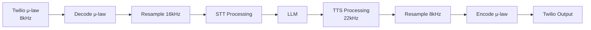

---

## 8. Latency Optimization Points

### 8.1 Optimization Opportunities

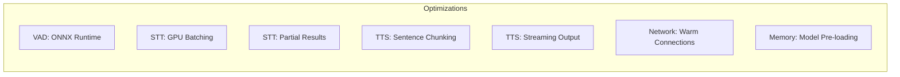

### 8.2 Latency Breakdown Target

| Stage | Current Est. | Target | Technique |
|-------|--------------|--------|-----------|
| Audio receive | 20ms | 20ms | — |
| μ-law decode | 1ms | 1ms | — |
| Resample | 2ms | 2ms | — |
| VAD check | 10ms | 5ms | ONNX |
| Silence detection | 700ms | 500ms | Tuning |
| STT processing | 400ms | 250ms | GPU + partial |
| LLM TTFT | 300ms | 200ms | Prompt optimization |
| TTS TTFB | 300ms | 150ms | Streaming |
| Resample + encode | 5ms | 5ms | — |
| **Total** | **~1.7s** | **~1.1s** | — |

---

## 9. Deployment Architecture

### 9.1 Local Development

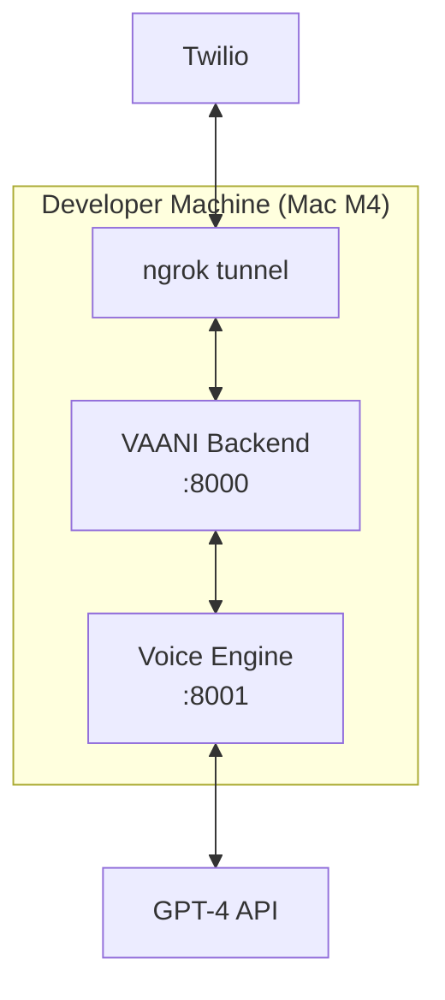

### 9.2 Production Deployment

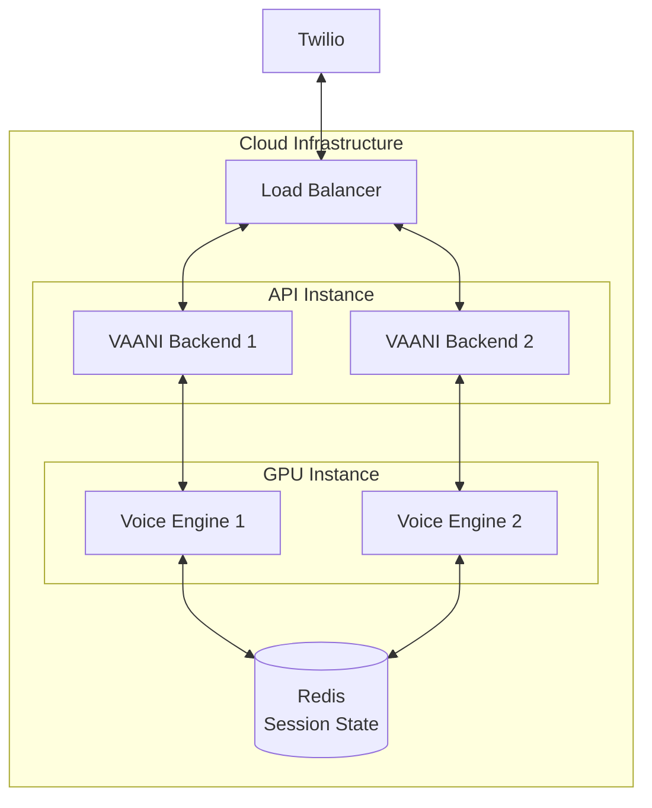

---

## 10. Monitoring Architecture

### 10.1 Metrics Collection

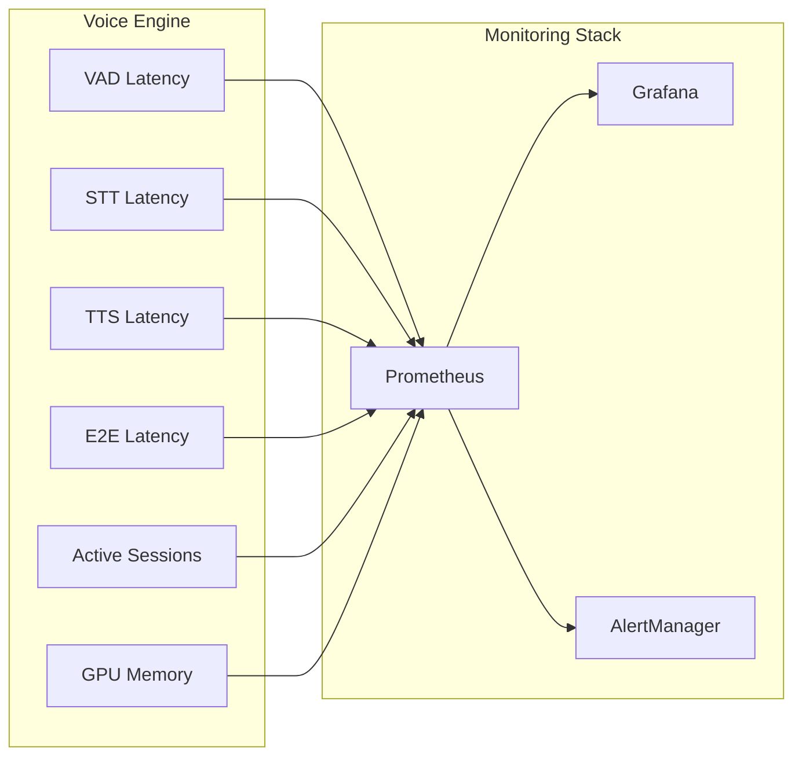

### 10.2 Key Metrics

| Metric | Type | Alert Threshold |
|--------|------|-----------------|
| `voice_e2e_latency_ms` | Histogram | p99 > 1500ms |
| `voice_stt_latency_ms` | Histogram | p99 > 600ms |
| `voice_tts_latency_ms` | Histogram | p99 > 400ms |
| `voice_active_sessions` | Gauge | > 15 |
| `voice_gpu_memory_percent` | Gauge | > 85% |
| `voice_fallback_rate` | Counter | > 10% |

---

## 11. Security Considerations

### 11.1 Security Layers

| Layer | Protection |
|-------|------------|
| **Transport** | TLS 1.3 for all WebSocket |
| **Authentication** | Session tokens, API keys |
| **Audio Data** | No logging of audio content |
| **API Keys** | Environment variables, secrets manager |
| **Network** | Private VPC, firewall rules |

### 11.2 Data Handling

- Audio data is **not persisted** (streaming only)
- Transcripts can be **optionally logged** (configurable)
- LLM requests contain **no PII** in system prompts
- Fallback APIs use **encrypted connections**
