# Vaani Engine - Latency Optimization Guide

> **Goal**: Achieve sub-800ms end-to-end latency for production voice AI

---

## 1. Latency Budget Analysis

### 1.1 Current State vs Target

| Stage | OpenAI Realtime | Cloud APIs | Self-Hosted (Current) | Target |
|-------|-----------------|------------|----------------------|--------|
| Audio Input | ~50ms | ~50ms | ~50ms | 50ms |
| VAD + Buffer | Included | ~100ms | ~700ms | 500ms |
| STT | ~100ms | ~200ms | ~400ms | 250ms |
| LLM (TTFT) | ~100ms | ~300ms | ~300ms | 200ms |
| TTS (TTFB) | ~150ms | ~100ms | ~300ms | 150ms |
| Audio Output | ~50ms | ~50ms | ~50ms | 50ms |
| **Total** | **~400ms** | **~800ms** | **~1800ms** | **~1200ms** |

### 1.2 Latency Anatomy

```mermaid
gantt
    title Voice Pipeline Latency (Current vs Target)
    dateFormat X
    axisFormat %L ms
    
    section Current
    Audio Input      :a1, 0, 50
    VAD/Buffer       :a2, after a1, 700
    STT              :a3, after a2, 400
    LLM TTFT         :a4, after a3, 300
    TTS TTFB         :a5, after a4, 300
    Audio Output     :a6, after a5, 50
    
    section Target
    Audio Input      :b1, 0, 50
    VAD/Buffer       :b2, after b1, 500
    STT              :b3, after b2, 250
    LLM TTFT         :b4, after b3, 200
    TTS TTFB         :b5, after b4, 150
    Audio Output     :b6, after b5, 50
```



---

## 2. VAD Optimization

### 2.1 End-of-Utterance Detection

The largest single latency contributor is **silence detection**. Default: 700ms of silence before sending to STT.

**Optimization Strategies:**

| Strategy | Latency Reduction | Trade-off |
|----------|-------------------|-----------|
| Reduce silence threshold | -200ms | More false positives |
| Adaptive thresholds | -150ms | Complexity |
| Energy-based pre-check | -100ms | Less accuracy |
| Prosodic cues | -200ms | Language dependent |

### 2.2 Recommended VAD Configuration

```python
class OptimizedVADConfig:
    # Core settings
    frame_duration_ms: int = 30
    sample_rate: int = 16000
    
    # Silence detection (aggressive for low latency)
    min_silence_duration_ms: int = 500    # Was 700ms
    speech_threshold: float = 0.6          # More confident speech detection
    
    # Speech validation
    min_speech_duration_ms: int = 200      # Ignore very short sounds
    
    # Adaptive silence (optional)
    use_adaptive_silence: bool = True
    adaptive_silence_min_ms: int = 400
    adaptive_silence_max_ms: int = 800
```

### 2.3 Adaptive Silence Detection

```python
def calculate_adaptive_silence(speech_duration_ms: int) -> int:
    """
    Shorter utterances → shorter silence threshold
    Longer utterances → longer silence threshold
    """
    if speech_duration_ms < 1000:
        return 400  # Quick responses
    elif speech_duration_ms < 3000:
        return 500  # Normal
    else:
        return 700  # Long speech, might continue
```

---

## 3. STT Optimization

### 3.1 Model Selection for Speed

| Model | Speed (RTF) | Accuracy | Hindi | Recommended |
|-------|-------------|----------|-------|-------------|
| Whisper large-v3 | 0.3x | Best | ✅ | Production |
| Whisper medium | 0.5x | Good | ✅ | Balanced |
| Whisper small | 1.0x | Fair | ⚠️ | Development |
| Distil-Whisper | 0.6x | Good | ⚠️ | Speed priority |

### 3.2 faster-whisper Optimization

```python
from faster_whisper import WhisperModel

model = WhisperModel(
    "large-v3",
    device="cuda",          # Use GPU
    compute_type="float16", # Faster than float32
    
    # Speed optimizations
    cpu_threads=4,          # If CPU fallback
    num_workers=1,          # Single worker for real-time
)

segments, info = model.transcribe(
    audio,
    language="hi",          # Skip language detection
    beam_size=1,            # Greedy decoding (faster)
    best_of=1,              # No sampling
    vad_filter=False,       # We handle VAD separately
    without_timestamps=True, # Skip timestamp computation
)
```

### 3.3 Streaming Partial Results

```python
async def transcribe_with_partials(audio_stream):
    """
    Send partial transcriptions to LLM before utterance is complete.
    LLM can start processing earlier.
    """
    buffer = []
    async for chunk in audio_stream:
        buffer.append(chunk)
        
        # Every 500ms, send partial
        if len(buffer) % 17 == 0:  # ~500ms at 30ms chunks
            partial = await model.transcribe(b"".join(buffer))
            yield PartialTranscription(
                text=partial,
                is_final=False
            )
    
    # Final transcription
    final = await model.transcribe(b"".join(buffer))
    yield PartialTranscription(text=final, is_final=True)
```

### 3.4 GPU Memory Optimization

```python
# Pre-load model at startup (avoid cold start)
model = None

async def lifespan(app):
    global model
    model = WhisperModel(...)  # Load on startup
    yield
    del model  # Cleanup on shutdown

# Use single model instance for all sessions
# Batching not recommended for real-time (adds latency)
```

---

## 4. LLM Optimization

### 4.1 Prompt Optimization

```python
# ❌ BAD: Long system prompt
SYSTEM_PROMPT_VERBOSE = """
You are VAANI, an AI voice receptionist for Dr. Sharma's clinic.
You help patients book appointments, answer questions about services,
provide information about the clinic hours, location, and available
doctors. You should be polite, professional, and concise...
[500+ tokens continue...]
"""

# ✅ GOOD: Concise system prompt
SYSTEM_PROMPT_OPTIMIZED = """
You are VAANI, a voice receptionist for Dr. Sharma's clinic.
Be helpful, concise. Max 2 sentences per response.
Available: Mon-Fri 9AM-5PM. Address: 123 Main St.
"""
```

### 4.2 Streaming Configuration

```python
import openai

async def get_response_streaming(transcript: str):
    response = await openai.chat.completions.create(
        model="gpt-4-turbo",
        messages=[
            {"role": "system", "content": SYSTEM_PROMPT_OPTIMIZED},
            {"role": "user", "content": transcript}
        ],
        stream=True,           # Enable streaming
        max_tokens=100,        # Limit response length
        temperature=0.7,       # Balance creativity/speed
    )
    
    async for chunk in response:
        if chunk.choices[0].delta.content:
            yield chunk.choices[0].delta.content
```

### 4.3 Response Length Control

| Response Type | Max Tokens | Latency Impact |
|---------------|------------|----------------|
| Greeting | 30 | +50ms |
| Simple answer | 50 | +100ms |
| Explanation | 100 | +200ms |
| Long response | 200+ | +400ms+ |

**Strategy**: Instruct LLM to give short responses (1-2 sentences).

---

## 5. TTS Optimization

### 5.1 Streaming TTS

```python
async def synthesize_streaming(text: str):
    """
    Stream audio chunks as soon as they're generated.
    Don't wait for entire audio to be synthesized.
    """
    # Split into sentences for faster first-chunk
    sentences = split_into_sentences(text)
    
    for sentence in sentences:
        async for chunk in tts.synthesize_stream(sentence):
            yield chunk
```

### 5.2 Sentence Chunking Strategy

```python
import re

def split_into_sentences(text: str) -> list[str]:
    """
    Split text into sentences for incremental TTS.
    """
    # Hindi + English sentence boundaries
    pattern = r'[।\.\?\!]+\s*'
    sentences = re.split(pattern, text)
    return [s.strip() for s in sentences if s.strip()]
```

### 5.3 TTS Configuration for Speed

```python
class TTSSpeedConfig:
    # XTTS-v2 settings
    speed: float = 1.1           # Slightly faster speech
    temperature: float = 0.65    # Less randomness = faster
    repetition_penalty: float = 5.0
    
    # Audio output
    sample_rate: int = 22050
    output_sample_rate: int = 8000  # Twilio requirement
    
    # Streaming
    chunk_size_samples: int = 4096  # ~185ms chunks
```

### 5.4 Pre-caching Common Phrases

```python
COMMON_PHRASES = {
    "hello": b"...",  # Pre-synthesized audio
    "goodbye": b"...",
    "please_hold": b"...",
    "booking_confirmed": b"...",
}

async def synthesize_with_cache(text: str):
    # Check cache first
    text_lower = text.lower().strip()
    if text_lower in COMMON_PHRASES:
        return COMMON_PHRASES[text_lower]
    
    # Otherwise synthesize
    return await tts.synthesize(text)
```

---

## 6. Network Optimization

### 6.1 Connection Management

```python
class ConnectionPool:
    """
    Maintain warm connections to avoid overhead.
    """
    def __init__(self):
        self._openai_client = None
        self._deepgram_client = None
        self._cartesia_client = None
    
    async def get_openai_client(self):
        if self._openai_client is None:
            self._openai_client = AsyncOpenAI()
        return self._openai_client
```

### 6.2 Parallel Processing

```python
async def process_utterance(audio: bytes):
    """
    Overlap STT completion with LLM prefetch where possible.
    """
    # Start STT
    transcript_task = asyncio.create_task(stt.transcribe(audio))
    
    # Pre-warm LLM connection while STT runs
    llm_connection = asyncio.create_task(warmup_llm_connection())
    
    transcript = await transcript_task
    await llm_connection
    
    # Now LLM call starts with warm connection
    response = await get_llm_response(transcript)
```

---

## 7. End-to-End Optimization Checklist

### 7.1 VAD Layer
- [ ] Set silence threshold to 500ms (from 700ms)
- [ ] Enable adaptive silence detection
- [ ] Use ONNX runtime for VAD model
- [ ] Pre-load VAD model at startup

### 7.2 STT Layer
- [ ] Use `faster-whisper` with float16
- [ ] Set `beam_size=1` for greedy decoding
- [ ] Disable timestamp computation
- [ ] Pre-specify language (skip detection)
- [ ] Keep model warm in GPU memory

### 7.3 LLM Layer
- [ ] Reduce system prompt to <100 tokens
- [ ] Enable streaming responses
- [ ] Set `max_tokens=100` for responses
- [ ] Maintain persistent HTTP connection
- [ ] Consider prompt caching (if available)

### 7.4 TTS Layer
- [ ] Enable streaming synthesis
- [ ] Split text into sentences
- [ ] Pre-cache common phrases
- [ ] Use faster speech rate (1.1x)
- [ ] Optimize audio format conversion

### 7.5 Infrastructure
- [ ] Use GPU with high CUDA cores
- [ ] Minimize network hops to APIs
- [ ] Use connection pooling
- [ ] Pre-load all models at startup
- [ ] Monitor p99 latency continuously

---

## 8. Latency Monitoring

### 8.1 Metrics to Track

```python
from prometheus_client import Histogram

# Stage latencies
vad_latency = Histogram(
    'voice_vad_latency_seconds',
    'VAD processing latency',
    buckets=[0.001, 0.005, 0.01, 0.02, 0.05]
)

stt_latency = Histogram(
    'voice_stt_latency_seconds',
    'STT processing latency',
    buckets=[0.1, 0.2, 0.3, 0.5, 1.0]
)

tts_ttfb = Histogram(
    'voice_tts_ttfb_seconds',
    'TTS time to first byte',
    buckets=[0.05, 0.1, 0.2, 0.3, 0.5]
)

e2e_latency = Histogram(
    'voice_e2e_latency_seconds',
    'End-to-end latency',
    buckets=[0.5, 0.8, 1.0, 1.5, 2.0]
)
```

### 8.2 Alerting Thresholds

| Metric | Warning | Critical |
|--------|---------|----------|
| E2E p50 | >1.0s | >1.5s |
| E2E p99 | >1.5s | >2.0s |
| STT p99 | >0.5s | >0.8s |
| TTS TTFB p99 | >0.3s | >0.5s |

---

## 9. Expected Results

### 9.1 After Optimization

| Stage | Before | After | Improvement |
|-------|--------|-------|-------------|
| VAD Silence | 700ms | 500ms | -29% |
| STT | 400ms | 250ms | -38% |
| LLM TTFT | 300ms | 200ms | -33% |
| TTS TTFB | 300ms | 150ms | -50% |
| **Total** | **1800ms** | **1200ms** | **-33%** |

### 9.2 Comparison with OpenAI Realtime

| Metric | OpenAI Realtime | Optimized Self-Hosted |
|--------|-----------------|----------------------|
| E2E Latency | ~400ms | ~1200ms |
| Voice Quality | Good | Better (XTTS) |
| Hindi Support | Limited | Native |
| Cost/Month | ~$60 | ~$130 |
| Control | Limited | Full |

---

## 10. Future Optimizations

### 10.1 Phase 2 Improvements
- [ ] Implement speculative STT (process partial audio)
- [ ] Add LLM response caching for common queries
- [ ] Explore smaller, faster TTS models (Kokoro, MeloTTS)
- [ ] Implement predictive barge-in detection

### 10.2 Phase 3 Improvements
- [ ] Train domain-specific Whisper model (faster + accurate)
- [ ] Fine-tune TTS for faster inference
- [ ] Explore NVIDIA Riva for end-to-end optimization
- [ ] Implement audio-to-audio LLM (eliminate text intermediate)
